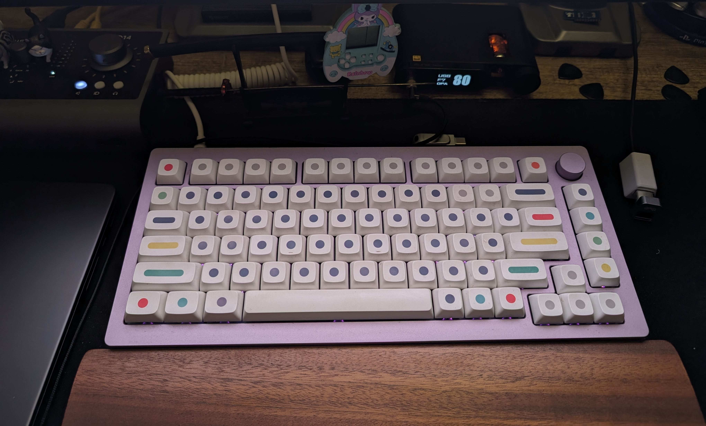
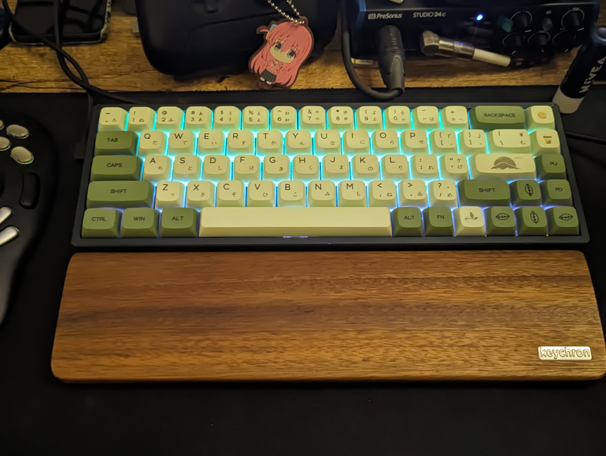

# Keyboard

## Current
### Primary 
Pink Monsgeek M1 with gateron oil kings and XDA Dots  

QMK: https://github.com/uttarayan21/qmk_firmware/tree/monsgeek_m1_servius

### Secondary
Keychron K6 with default gateron reds and matcha keycaps  


QMK: https://github.com/uttarayan21/qmk_firmware/tree/sn32_develop_k6


## Planned
### Corne 
Board: [petejohanson/crkbd][corne-pcb]  
Firmware: [haobogu/rmk][rmk]  
Model: [printables/void/crkbd][corne-3d-model]  
Keycaps: [kprepublic/xda-v2-gentleman-blank][xda-v2-gentleman-blank]  
Youtube: [youtube/EIGA/wireless-corne-keyboard-perfected][wireless-corne]  

#### Required
Note: This was taken from a stackskb.com listing of a wired corne kit and adapted to be a wireless kit   

- 1x PCB Set (left and right half of PCB)                   (we printed them)
- 2x Top Plates                                             (we printed them)
- 2x nice!nano compatible boards (supermini nrf52840)       (bought from robotkits.co.in)
- 2x nice!view displays                                     (bought from beekeeb.com) (60$ oof)
- 2x 600mah single cell lipo battery                        (bought from robu.in)
- 10x 8mm Brass Standoffs                                   (bought from robu.in)
- 20x 5mm screws                                            (bought from robu.in)
- 2x 2-pin SPST Switch (?)                                  (bought from robu.in)
- 45x SOD-123 Diodes (1N4148W)                              (bought from robu.in)
- 45x Gateron Hotswap sockets                               (bought from neomacro.in)

Other things that you'll need but not part of the keyboard  

Soldering Iron: Pinecil v2 (or any soldering iron you have)  
Patience: 1/0  

#### Ordering parts
- pcb: I am ordering from robu.in since I am from india and its cheapest option available
    robu.in needs a gerber zip file (same as jlcpcb).
    Use the zip file from the last step

- case:
    For the case you can get all the stl files from the links above.
    I used the 600mah battery and 6 column ones.
    For materials I used black abs at standard quality and 20% infill

#### Build Steps
0. Prepping
    - pcb:
        We need to export the corne kicad files as gerber first.  
        To do so first install kicad  
        for macos you can just do  
        ```sh
        brew install --cask kicad
        ```
        for windows you'll have to manually install by navigating to the website  
        and for linux use whatever package manager your distro comes with.
        In kicad open the file `corne-ultralight.kicad_pro` file  
        Then click on the pcb editor  
        On the pcb editor click on the plot button ( the one that looks like a printer with legs )  
        Then click on Plot and then on Generate Drill files  
        This should make a gerbers folder on that same directory.  
        Zip it up and send it for printing.  

1. Soldering
    First we need to solder the hotswap sockets and the diodes to the pcb
    
    Align the diodes with a tweezer and then solder it to the pad rinse and repeat for all (6*3+3)*2 = 42 times

    Align the hotswap socket in place and make sure to put the socket facing the hole face up.


[corne-pcb]: https://github.com/petejohanson/crkbd/tree/board/corne-ultralight
[corne-3d-model]: https://www.printables.com/model/347524-corne-keyboard-case-5-and-6-columns
[xda-v2-gentleman-blank]:  https://kprepublic.com/products/xda-v2-gentleman-blank-set-thick-pbt-for-keyboard-gh60-poker-87-tkl-104-ansi-xd64-bm60-xd68-bm65-bm68-dark-grey-black-yellow
[wireless-corne]: https://www.youtube.com/watch?v=YlZPnh9cbQU
[rmk]: https://github.com/HaoboGu/rmk


