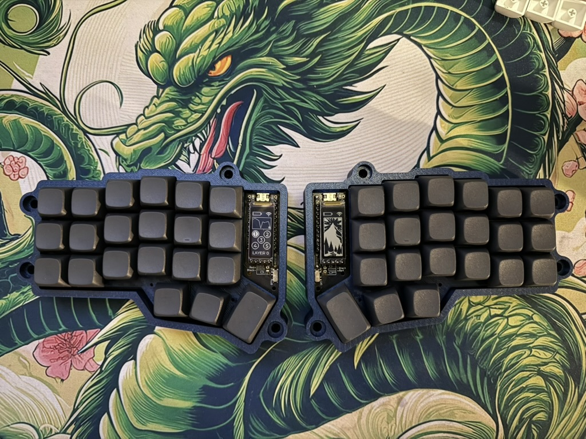
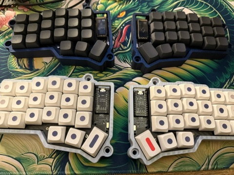

# Keyboard

Index:-  

- [Current](#current)
- [Vendors](#vendors)

## Current
### Primary
Blue Corne Ultralight with Gateron Oil kings and XDA Gentleman Blanks

### Secondary
Gray Corne Ultralight with Gateron Oil Kings and XDA Dots V2

## Older
###  Primary
Pink Monsgeek M1 with gateron oil kings and XDA Dots  

QMK: https://github.com/uttarayan21/qmk_firmware/tree/monsgeek_m1_servius

### Secondary
Keychron K6 with default gateron reds and matcha keycaps  

QMK: https://github.com/uttarayan21/qmk_firmware/tree/sn32_develop_k6

## Vendors
The places I buy parts and stuff from
 
- [Vendors](./vendors.md)

## Planned
1. [Wireless Corne](./corne/corne.md)
